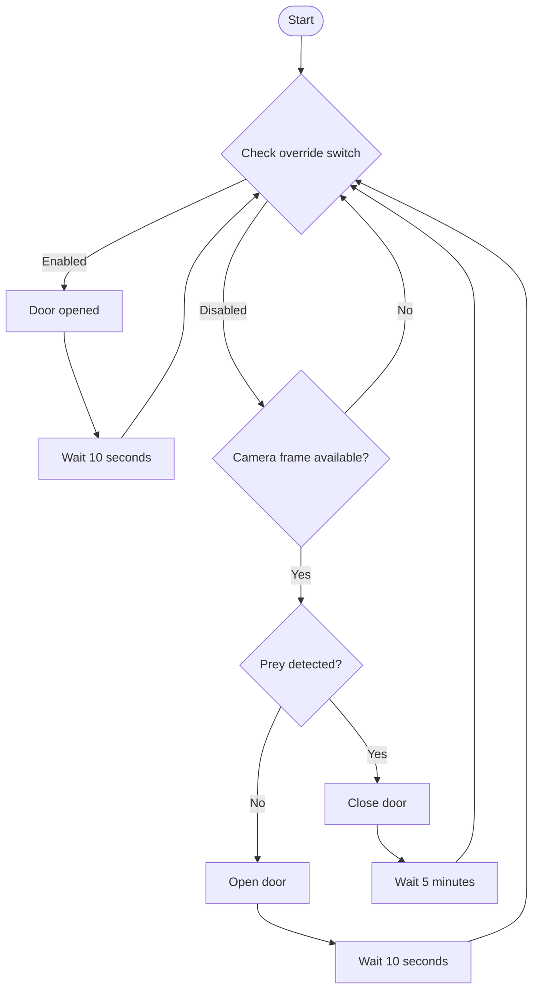

# smart_cat_door

```mermaid
graph TD
        A(["Start"])
        A --> B{"Check override switch"}
        B --Enabled--> C["Door opened"]
        C --> J["Wait 10 seconds"]
        J --> B
        B --Disabled--> D{"Camera frame available?"}
        D --Noo--> B
        D --Yes--> E{"Prey detected?"}
        E --Yes--> F["Close door"]
        E --Noo--> G["Open door"]
        G --> H["Wait 10 seconds"]
        F --> I["Wait 5 minutes"]
        H --> B
        I --> B
```

