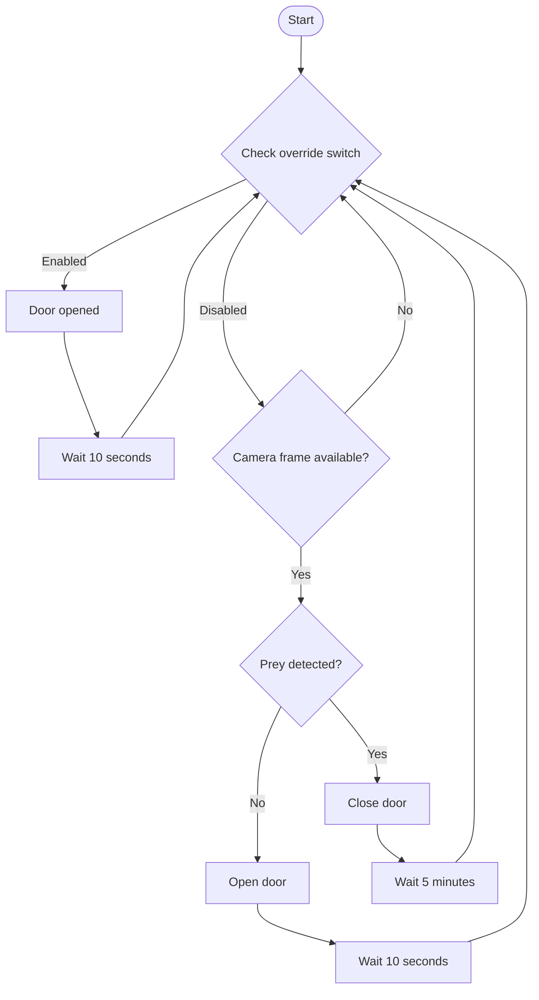

# smart_cat_door



## Viewing the camera feed remotely

Camera is on a link-local network wired only to the Pi's `eth0` — not reachable from another machine directly, even over VPN. Tunnel through the Pi over SSH:

```bash
ssh -L 8554:169.254.1.1:554 carbotton@<pi-address> -N
```

Then, from the other machine — force TCP transport, since SSH `-L` only tunnels TCP and RTSP video normally goes over UDP (VLC's client falls back to UDP regardless, breaking the tunnel; `ffplay` respects the flag):

```bash
ffplay -rtsp_transport tcp rtsp://localhost:8554/live/0/MAIN
```

